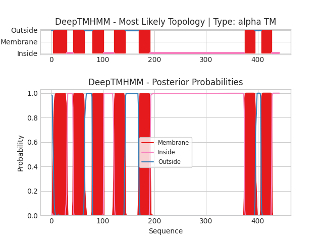

## DeepTMHMM - Predictions
Predicted topologies can be downloaded in [.gff3 format](TMRs.gff3) and [.3line format](predicted_topologies.3line)

You can download the probabilities used to generate this plot [here](2rh1_A_probs.csv)
### Predicted Topologies
```
>2rh1_A | TM
DEVWVVGMGIVMSLIVLAIVFGNVLVITAIAKFERLQTVTNYFITSLACADLVMGLAVVPFGAAHILMKMWTFGNFWCEFWTSIDVLCVTASIETLCVIAVDRYFAITSPFKYQSLLTKNKARVIILMVWIVSGLTSFLPIQMHWYRATHQEAINCYAEETCCDFFTNQAYAIASSIVSFYVPLVIMVFVYSRVFQEAKRQLNIFEMLRIDEGLRLKIYKDTEGYYTIGIGHLLTKSPSLNAAKSELDKAIGRNTNGVITKDEAEKLFNQDVDAAVRGILRNAKLKPVYDSLDAVRRAALINMVFQMGETGVAGFTNSLRMLQQKRWDEAAVNLAKSRWYNQTPNRAKRVITTFRTGTWDAYKFCLKEHKALKTLGIIMGTFTLCWLPFFIVNIVHVIQDNLIRKEVYILLNWIGYVNSGFNPLIYCRSPDFRIAFQELLCL
OOMMMMMMMMMMMMMMMMMMMMMMMMMMMMIIIIIIIIIIIIMMMMMMMMMMMMMMMMMMMMMMOOOOOOOOOOOOOOOMMMMMMMMMMMMMMMMMMMMMMIIIIIIIIIIIIIIIIIIIIMMMMMMMMMMMMMMMMMMMMMMOOOOOOOOOOOOOOOOOOOOOOOOOOMMMMMMMMMMMMMMMMMMMMMMIIIIIIIIIIIIIIIIIIIIIIIIIIIIIIIIIIIIIIIIIIIIIIIIIIIIIIIIIIIIIIIIIIIIIIIIIIIIIIIIIIIIIIIIIIIIIIIIIIIIIIIIIIIIIIIIIIIIIIIIIIIIIIIIIIIIIIIIIIIIIIIIIIIIIIIIIIIIIIIIIIIIIIIIIIIIIIIIIIIIIIIMMMMMMMMMMMMMMMMMMMMMOOOOOOOOOOOMMMMMMMMMMMMMMMMMMMMMIIIIIIIIIIIIIII

```


```
##gff-version 3
# 2rh1_A Length: 442
# 2rh1_A Number of predicted TMRs: 7
2rh1_A	outside	1	2				
2rh1_A	TMhelix	3	30				
2rh1_A	inside	31	42				
2rh1_A	TMhelix	43	64				
2rh1_A	outside	65	79				
2rh1_A	TMhelix	80	101				
2rh1_A	inside	102	121				
2rh1_A	TMhelix	122	143				
2rh1_A	outside	144	169				
2rh1_A	TMhelix	170	191				
2rh1_A	inside	192	374				
2rh1_A	TMhelix	375	395				
2rh1_A	outside	396	406				
2rh1_A	TMhelix	407	427				
2rh1_A	inside	428	442				

```
